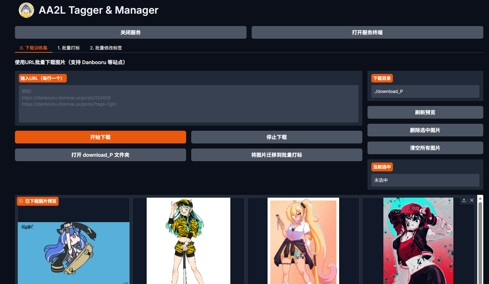
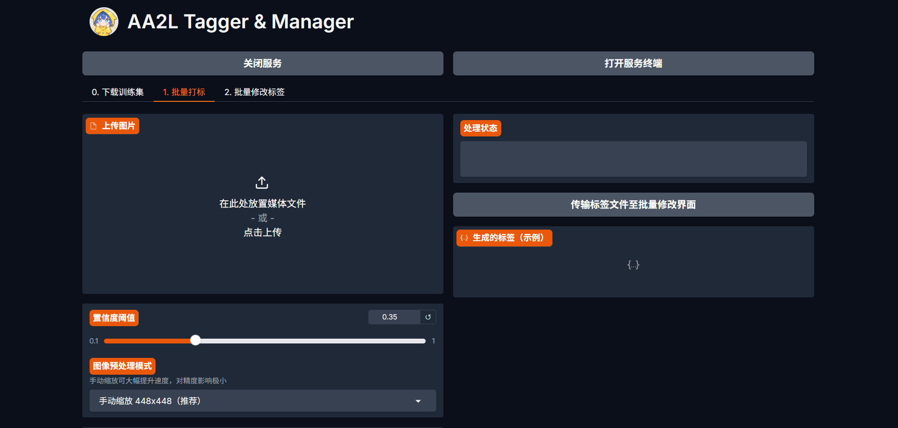
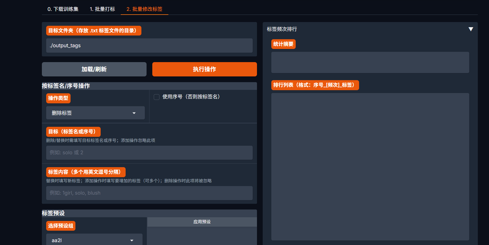
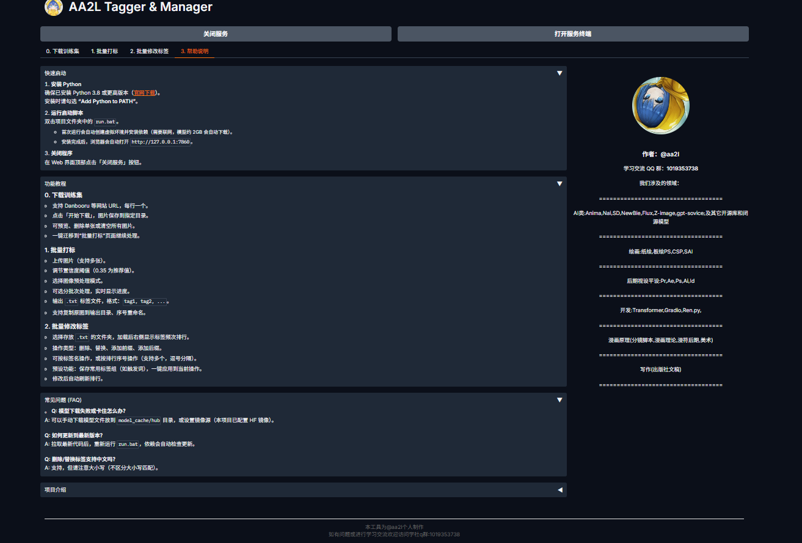

# AA2L Tagger & Manager
一个基于 WD Tagger (后续会更新其他模型) 的本地批量图像打标与标签管理工具，提供 Web UI，帮助 AI 训练者高效处理图片数据集。
(其实是我自己训练时没有一个顺手的工具所以做了:)
 
 
---

## 功能概览

- **批量打标**：上传多张图片，一键生成 .txt 标签文件（Danbooru 风格标签）
- **可调置信度阈值**：控制标签输出的严格程度
- **图像预处理**：可选择模型内部缩放（原图模式）或手动缩放至 384/448/512 像素，平衡速度与精度
- **分批次处理**：支持开关及批次大小调节（1~21），实时显示处理进度
- **输出目录管理**：自定义输出路径，可选复制原图、序号重命名
- **批量修改标签**：对文件夹内所有 .txt 文件进行删除、替换、添加前缀/后缀操作，支持按标签名或序号操作
- **标签预设管理**：保存常用标签组，一键应用到当前操作
- **下载训练集**：集成 gallery-dl，通过 URL 批量下载图片（支持 Danbooru 等站点），内置预览、删除、清空及迁移至打标页面
- **跨页面数据流转**：一键将打标生成的标签文件传给“修改标签”页面，或将下载的图片直接导入“批量打标”
- **配置持久化**：用户设置（阈值、输出目录等）自动保存，下次启动恢
- ** CPU 推理**：西天取经是不可以用筋斗云的
---

## 界面预览

### 0. 下载训练集


### 1. 批量打标


### 2. 批量修改标签


### 3. 帮助说明


---

## 快速开始

### 环境要求
- Windows 10 / 11（主要支持），macOS / Linux 可尝试手动运行
- Python 3.8 或更高版本（[官网下载](https://www.python.org/downloads/)），安装时请勾选“Add Python to PATH”

### 安装与运行
1. **下载项目**（轻量版，不含模型和虚拟环境）  
   克隆仓库或下载 ZIP 包到本地。
2. **双击 `run.bat`**  
   - 首次运行会自动创建虚拟环境、安装依赖（使用清华镜像源）并下载模型（约 2GB）。  
   - 等待浏览器自动打开 `http://127.0.0.1:7860`。
3. **使用**  
   按照界面各标签页的说明进行操作。
4. **关闭服务**  
   点击 WebUI 顶部的「关闭服务」按钮，或直接关闭命令行窗口（服务后台进程会被终止）。

### 注意事项
- 模型下载需要联网，如果失败可手动下载 `SmilingWolf/wd-vit-large-tagger-v3` 放入 `model_cache/hub` 目录。
- 打标速度取决于 CPU，推荐使用手动缩放（448x448）提速。
- 批量修改标签时，序号操作与标签名操作不可混用。

---

## 项目结构

```text
AA2L-Tagger-Manager/
├── my_tagger.py
├── service_manager.py
├── settings_manager.py
├── modules/
│   ├── batch_tagging.py
│   ├── modify_tags.py
│   ├── preset_manager.py
│   └── ...
├── install_dependencies.bat
├── run.bat
└── requirements.txt
```
---

## 常见问题

**Q: 为什么打标速度较慢？**  
A: 为了快速启动或者只使用反推以外的功能，当前采用懒加载模式，即每次打开网页后第一次点击反推才开始加载模型。

**Q: 模型下载失败怎么办？**  
A: 可手动下载模型文件放入 `model_cache/hub`，或切换网络后重新运行 `run.bat`。

**Q: 如何更新到最新版本？**  
A: 拉取最新代码后，重新运行 `run.bat`，依赖会自动检查更新（如有新增依赖）。

**Q: 支持 GPU 吗？**  
A: 目前仅支持 CPU，因为 wdtagger 与 onnxruntime-gpu 存在兼容性问题。

**Q: 标签文件格式是怎样的？**  
A: 每个 .txt 文件内容为逗号分隔的标签，例如：`1girl, solo, blush, ...`。

---

## 作者

**@aa2l**  
学习交流 QQ 群：`1019353738`  
===============================
 [欢迎各位莅临小群](aa3l.png)
🫶🫶🫶
我们涉及的领域：

AI类:Anima,Nai,SD,NewBie,Flux,Z-image,gpt-sovice;及其它开源库和闭源模型


后期视设平设:Pr,Ae,Ps,Ai,Id

开发:Transformer,Gradio,Ren.py,

漫画原理(分镜脚本,漫画理论,漫符后期,美术)

写作(出版社文稿)

